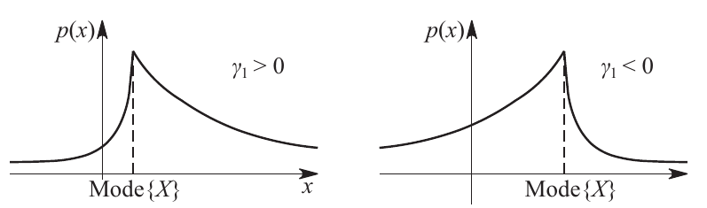

## Moments

Moments are defined for every distribution. These are generalized functions which find use in a variety of statistical experimental data analysis. In particular, we briefly elucidate how various moments are used to characterize the shape of a distribution.

Finally, we note in passing that a distribution may be **totally described** via its moments.

Moments

: The expectation $E\{(X-a)^k\}$ is called the **$k^{th}$ moment** of the random variable $X$ about the number $a$

## Initial Moments

Moments about zero are often referred to as the moments of a random variable or the initial moments.

The $k^{th}$ moment satisfies the relation:

$$
\alpha_k=E\{X^k\}=
\begin{cases}
\sum_i x_i^k p_i & Discrete \\
\int\limits_{-\infty}^{\infty} x^k p(x)\, dx & Continuous
\end{cases}
$$

## Central Moments

When $a=E\{X\}$, then the $k^{th}$ moment of the random variable $X$ about $a$ is called the **$k^{th}$ central moment**.

The $k^{th}$ central moment satisfies the relation:

$$
\mu_k=E\{(X-E\{X\})^k\}=
\begin{cases}
\sum_i (x_i-E\{X\})^k p_i & Discrete \\
\int\limits_{-\infty}^{\infty} (x-E\{X\})^k p(x)\, dx & Continuous
\end{cases}
$$

**Remark:** We note that $\mu_0=1$ and $\mu_1=0$ for random variables.

## Central and Initial Moment Relations

We have:

$$ \mu_k=\sum^k_{m=0} C^m_k\alpha_m(\alpha_1)^{k-m} $$

$$ \alpha_0=1 $$

$$ \alpha_k=\sum_{m=0}^k C^m_k\mu_m(\alpha_1)^{k-m} $$

Also we note that, for distributions _symmetric_ about the expectation, the existing central moments $\mu_k$ of **even order** $k$ are zero.

## Condition for Unique Determinacy

A probability distribution may be uniquely determined by the moments $\alpha_0,=\alpha_1,\cdot$ provided that they all exist and the following condition is satisfied:

$$ \sum_{m=0}^{\infty} |\alpha_m|\frac{t^m}{m!} $$

## Additional Moments

### Absolute Moments

The **$k^{th}$ absolute moment** of $X$ about $a$ is defined by:

$$ m_k=E\{|X-a|^k\} $$

The existence of a $k^{th}$ moment $\alpha_k$ or $\mu_k$ implies the existence of the moments $\alpha_m$ and $\mu_m$ of all orders $m<k$

### Mixed Moments

We note in passing that the _mixed second moment_ is better known as the covariance of two random variables and is defined as the central moment of order (1+1):

$$ \text{Cov}(X_1,X_2)=\alpha_{1,1}=E\{(X_1-E\{X_1\})(X_2-E\{X_2\})\} $$

## Moment Interpretations

We note the following:

- The _first initial moment_ is the **expectation**.
- The _second central moment_ is the **variance**.
- The _third central moment_ is related to the **skewness**.
- The _fourth central moment_ is related to the **kurtosis**.

Skewness

: A measure of lopsidedness, $0$ for symmetric distributions. (a.k.a asymmetry coefficient)

Mathematically: $$ \gamma_1=\frac{\mu_3}{(\mu_2)^{1.5}}$$

{#fig:skew}

Kurtosis

: A measure of the heaviness of the tail of the distribution, compared to the normal distribution of the same variance. (a.k.a excess, excess coefficient) \marginpar{A Gaussian has a kurtosis of 3}
Essentially a measure of the tails of the distribution compared with the tails of a
Gaussian random variable. [@florescu2013handbook]

Mathematically [@polyanin2010concise]: $$ \gamma_2=\frac{\mu_4}{\mu_2^2}-3$$

## References
