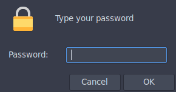
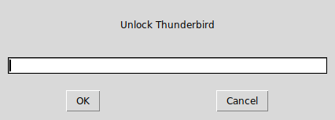

---
title: Locking and Encrypting Apps with Encfs
metaTitle: true
date: Thu Aug 16 2018 
blurb: Per application password and encryption for Linux.
tags: [applications, tricks, writing, security, lock]
author: [Rohit Goswami]
layout: article
autotoc: true
cleveref: On
code: true
draft: false
xnos-number-sections: On
...

For those who prefer it, this post is also [on Medium](https://medium.com/@HaoZeke/locking-and-encrypting-apps-with-encfs-c1484e77f479).

## Introduction
One of the problems of a shared system, is that sometimes multiple applications
are used by multiple people. Normally this would be solved by the excellent
multi-user support inherent to Linux systems. After all, Unix and derivatives
were [designed to be](https://www.wikiwand.com/en/History_of_Unix) used by
multiple users at the same time.

However, in some cases, it just makes sense for a single application to stay
locked until a password is supplied. In any case,
[encfs](https://wiki.archlinux.org/index.php/EncFS) is one of the better
encryption methods (as long as usability overshadows security) and it's a good
practice to encrypt application data anyway. The case for encryption varies, but
weather it's to make life harder for hackers, or just to stop cloud storage
providers from sniffing around, it's a good idea. Even if multiple users were
not sharing an account, encryption prevents the `root users` or `admins` from
getting too frisky with your data. 

The popular [gnome-keyring](https://wiki.archlinux.org/index.php/GNOME/Keyring)
and other security authentication methods are not a good fit for this since most
of them are unlocked all at once and without being linked to a particular
program.

Here we will create a few simple bash scripts to generically and flexibly lock
and encrypt applications in a way which allows for multiple users to have their
own private encrypted instances of shared apps. The complete scripts are located
in my [Dotfiles](https://github.com/HaoZeke/Dotfiles/blob/master/dotfiles/common/.local/bin/cryptHelpers/unlockEncfsApp.sh).

<!-- TODO Update link to script -->

<!-- TODO Add a use cases article discussing Master Passwords and the extension along -->
<!-- with the changes in thunderbird and also discuss pidgin. -->

## Requirements

The basic requirements are commonly found across most UNIX systems and it's
derivatives including MacOS, Ubuntu and other Debian distros, RPM based systems
etc.

I personally run [Arch Linux](https://www.archlinux.org/) but that's just a
biased endorsement.

The requirements are:

[Bash](https://www.gnu.org/software/bash/)

:  This is needed for the shell substitutions in the shell script. Usually found
   almost everywhere.

[EncFS](https://github.com/vgough/encfs)

: This handles the encryption portion. Though everything covered here will
  require only the base program itself, new users would probably benefit from
  having one of the GUI interfaces to `encfs` as well. I prefer [Gnome Encfs Manager](https://launchpad.net/gencfsm).

An ASKPASS program

: These are most famously known for weird `ssh` errors. However, here we will
  focus on [zenity](https://www.wikiwand.com/en/Zenity) and [git](https://git-scm.com/) as a fallback.

And that's it. Other variations of this method might use [shoes](shoesrb.com/)
for more GUI goodness. Other `askpass` programs and helpers may also be used,
like the popular
[x11-ssh-askpass](https://github.com/sigmavirus24/x11-ssh-askpass) program.

## Program Structure

Our basic structure is simple.

1. An encrypted folder is mounted
2. The application is run

Additionally we would like the following features:

<!-- 3. A GUI for obtaining the password (allowing for a non-terminal execution) -->
3. Execution without the terminal (GUI, no terminal user queries)
4. An automated way of generating a new stash for applications
5. A sanitized name for the mount points

### Preliminaries

Before getting to the creation of a script, I like to experiment with the
native shell. In this case this simply involved checking the following:

```bash
# Testing the mount
encfs ~/.cryptTest ~/cryptTest
```

- This prompted me to create the directory if it didn't exist, which would not be
handled properly from within a shell script.

Additionally the MAN page for `encfs` showed me that support for external
authentication managers is granted via the `--extpass` flag.

## Implementation

With those preliminaries out of the way, it is time to start scripting.
Portions which require the bash shell specifically will have the shebang
included.

Always remember to start the script with it and to only put it once, right at
the top of the file.

```bash
#!/usr/bin/bash
```

### Setting Variables
Initially we might simply set an unlock string as follows:

```bash
unlockString="Unlock $1"
```

### Choosing an ASKPASS program

Because scripts can quickly get clunky without intending too, we will first add
a simple variable which is suitable for running the external authentication.



```bash
askPass="zenity --password --title=$unlockString"
```

As mentioned previously, [zenity](https://www.wikiwand.com/en/Zenity) is the
prettier choice, however, it may not be installed everywhere. So we need a
fallback.

[Git](https://git-scm.com/) is more or less available everywhere, and it just so
happens to have a pretty neat `askpass` tool as well.



```bash
askPass="/usr/lib/git-core/git-gui--askpass $unlockString"
```

However, it would be better to wrap them both up in a way to pick one or the
other based on the availability. So, we write a simple test.

```bash
if which zenity >/dev/null 2>&1; then
    askPass="zenity --password --title=$unlockString"
elif which git >/dev/null 2>&1; then
    askPass="/usr/lib/git-core/git-gui--askpass $unlockString"
else echo "ERROR: No valid (zenity or git) askpass program available\n"
     fi
```

Honestly the usage of `which` instead of `command -v` is a bit controversial.
However, here I went with `which` simply because it seemed faster. The more
portable (POSIX compliant) version of the above would use `command -v`. For more
details check [this stack exchange question](https://stackoverflow.com/questions/592620/how-to-check-if-a-program-exists-from-a-bash-script).

### Creating Mount-points

[Gnome Encfs Manager](https://launchpad.net/gencfsm) defaults to removing the
mount point when the stash is unmounted, however, this causes a terminal input
demand which needed to be suppressed, hence the directories are created prior to
running Encfs.

```bash
cryptDir="$HOME/Encfs/.$1"
appDir="$HOME/.decrypt/$1"

if [ ! -d $appDir ]; then
    mkdir -p $appDir
fi 
```

#### Caveats

The above snippet does not deal with situations where:

* The stash is already mounted
* The stash does not exist

These are dealt with in the [Improvements](#improvements) section of this document.

### Mount and Run

Now we are in a position to simply mount our stash and run the program.

```bash
encfs --extpass="$askPass" $cryptDir $appDir
$1
```

#### Caveats

At this stage the script is not equipped to deal with situations where:

* The mount operation fails (wrong password)
* The config files are encrypted

The script runs the program without testing the result of the mount, which will
lead to much frustration and weird errors. These are fixed in [Handling Authentication](#handling-authentication).

## Improvements

Several improvements to the basic script created above are discussed in this
section.

### Naming directories

This is actually not a really important bit, however, I wanted the app
directories to start with **capital** letters. Also I wanted the encrypted data
to be stored in a *hidden* folder.

In any case, this portion of the script uses a bash specific expansion. At this
point we can also make the `unlockString` a little neater.

```bash
#!/usr/bin/bash
# bash specific
tempName=( $1 )
appName=$(echo "${tempName[@]^}")
unlockString="Unlock $appName"
```

Now that we have the name, we simply modify the directories.

```bash
cryptDir="$HOME/Encfs/.$appName"
appDir="$HOME/.decrypt/$appName"
```

### Handling mounted directories

To ensure that the script is able to eventually deal with situations where the
command is run in succession, a check is required to figure out if the mount
point is currently mounted.

If it is mounted, we will unmount it.

```bash
if [ ! -d $appDir ]; then
    mkdir -p $appDir
elif [[ $(findmnt -M "$appDir") ]]; then
    echo "Mounted"
    encfs -u $appDir
else
    echo "Not mounted"
fi
```

### Stash creation

Additionally, for cases where the stash does not yet exist, we will need to
create the other directory as well. We shall also kill the application if the
stash is to be mounted (for security). This portion was aided by [this stack exchange thread](https://stackoverflow.com/questions/9422461/check-if-directory-mounted-with-bash).

```bash
if [ ! -d $appDir ]; then
    mkdir -p $appDir
elif [[ $(findmnt -M "$appDir") ]]; then
    echo "Mounted"
    # Added here
    killall -9 $1
    encfs -u $appDir
    exit 1
else
    echo "Not mounted"
fi

if [ ! -d $cryptDir ]; then
    mkdir -p $cryptDir 
fi
```

### Handling Authentication

Finally we shall deal with cases where the script executes and the stashes
exist, but the password is incorrect. Additionally, we shall deal with managing
the flow of control via the `$?` variable.

Quite simply, the `$?` variable holds the result of the previous command. Hence
it can be used to control the flow. This was inspired by the answers [here](https://unix.stackexchange.com/questions/22726/how-to-conditionally-do-something-if-a-command-succeeded-or-failed).

```bash
# Run the program is the stash was mounted

RESULT=$?
if [ $RESULT -eq 0 ]; then
  echo success
  $1
else
  echo failed
  rm -rf $appDir
fi
```

## Putting it all together

For the latest revisions check [my Dotfiles](https://github.com/HaoZeke/Dotfiles/blob/master/dotfiles/common/.local/bin/cryptHelpers/unlockEncfsApp.sh).

It is also reproduced here.

```bash
#!/usr/bin/bash

# Usage
# unlockEncfsApp.sh $appname

# Copyright (c) 2018 Rohit Goswami <rohit dot goswami at yahoo dot com>

# Permission is hereby granted, free of charge, to any person obtaining
# a copy of this software and associated documentation files (the
# "Software"), to deal in the Software without restriction, including
# without limitation the rights to use, copy, modify, merge, publish,
# distribute, sublicense, and/or sell copies of the Software, and to
# permit persons to whom the Software is furnished to do so, subject to
# the following conditions:

# The above copyright notice and this permission notice shall be
# included in all copies or substantial portions of the Software.

# THE SOFTWARE IS PROVIDED "AS IS", WITHOUT WARRANTY OF ANY KIND,
# EXPRESS OR IMPLIED, INCLUDING BUT NOT LIMITED TO THE WARRANTIES OF
# MERCHANTABILITY, FITNESS FOR A PARTICULAR PURPOSE AND
# NONINFRINGEMENT. IN NO EVENT SHALL THE AUTHORS OR COPYRIGHT HOLDERS BE
# LIABLE FOR ANY CLAIM, DAMAGES OR OTHER LIABILITY, WHETHER IN AN ACTION
# OF CONTRACT, TORT OR OTHERWISE, ARISING FROM, OUT OF OR IN CONNECTION
# WITH THE SOFTWARE OR THE USE OR OTHER DEALINGS IN THE SOFTWARE.

#
# Program Implementation
#

# Get a capitalized app name
# bash specific
tempName=( $1 )
appName=$(echo "${tempName[@]^}")
unlockString="Unlock $appName"

# Determine the appropriate ASKPASS program

if which zenity >/dev/null 2>&1; then
    askPass="zenity --password --title=$unlockString"
elif which git >/dev/null 2>&1; then
    askPass="/usr/lib/git-core/git-gui--askpass $unlockString"
else echo "ERROR: No valid (zenity or git) askpass program available\n"
     fi

#
# TODO work on the logic when the folder is mounted
#

# Create the directories
cryptDir="$HOME/Encfs/.$appName"
appDir="$HOME/.decrypt/$appName"

if [ ! -d $appDir ]; then
    mkdir -p $appDir
elif [[ $(findmnt -M "$appDir") ]]; then
    echo "Mounted"
    # Added later
    killall -9 $1
    encfs -u $appDir
    exit 1
else
    echo "Not mounted"
fi

if [ ! -d $cryptDir ]; then
    mkdir -p $cryptDir
fi

# Mount the stash

# TODO handle cases where the stash is created for the first time

encfs --extpass="$askPass" $cryptDir $appDir

# Run the program is the stash was mounted

RESULT=$?
if [ $RESULT -eq 0 ]; then
  echo success
  $1
else
  echo failed
  rm -rf $appDir
fi

```

## Future Directions

There ought to be a non-terminal way of creating the stash for the first time.
Also, it may be interesting to work on the rules and configuration schemes for a
variety of applications.
